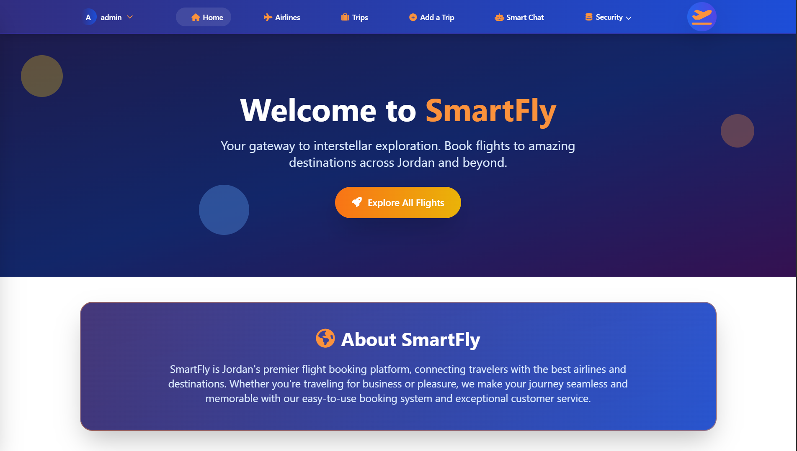
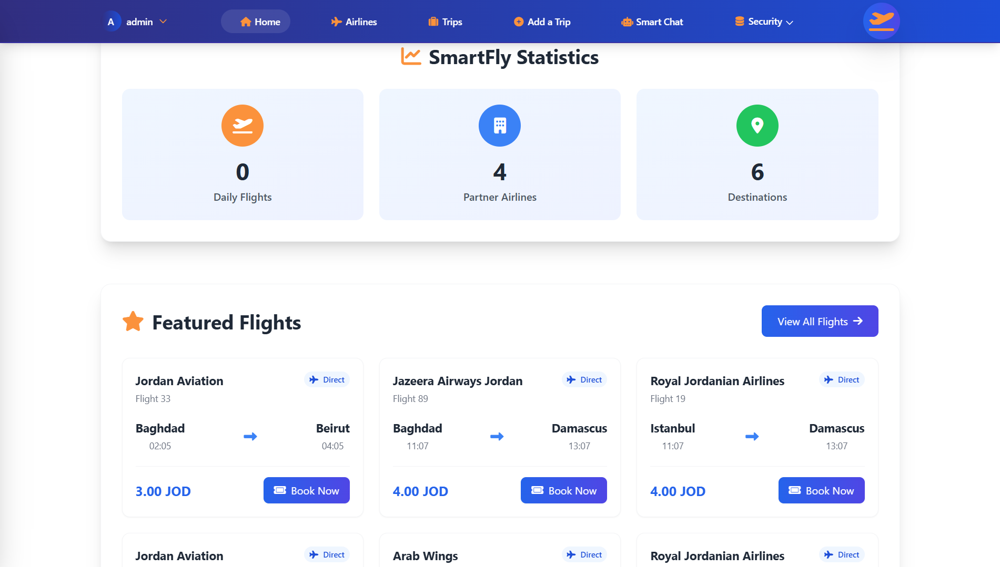
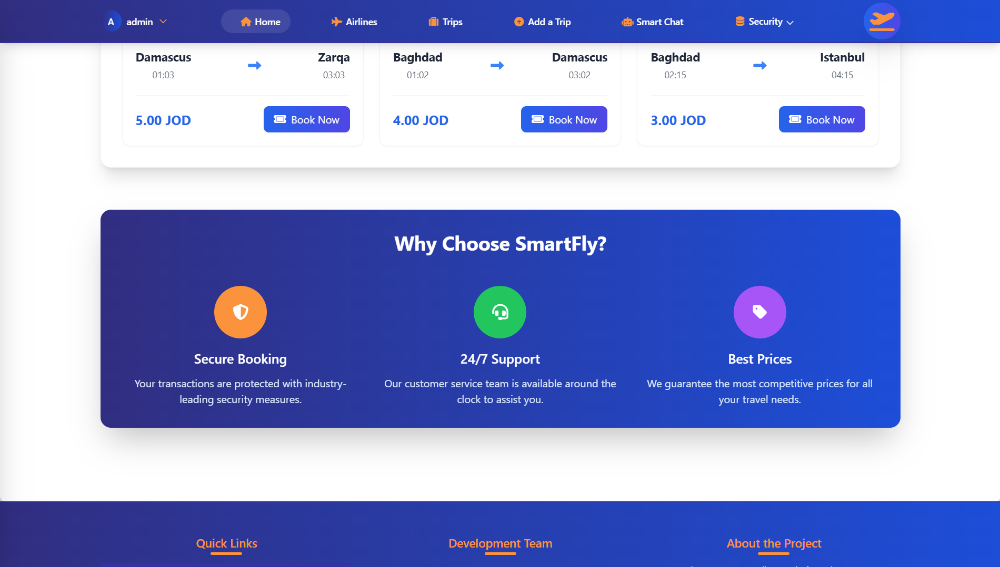
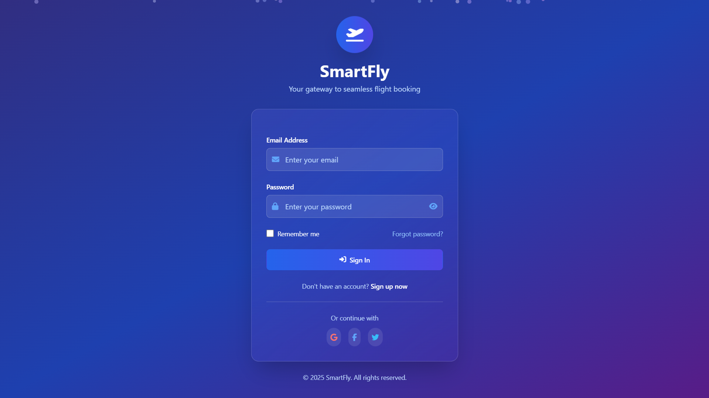
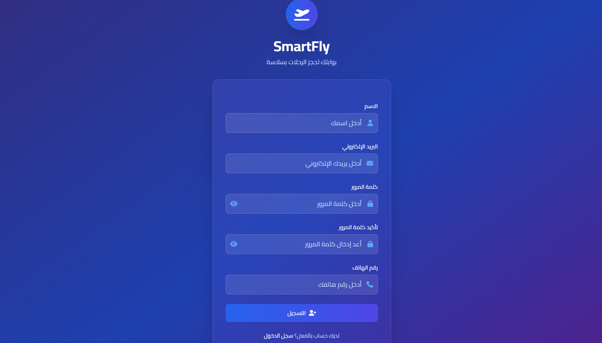
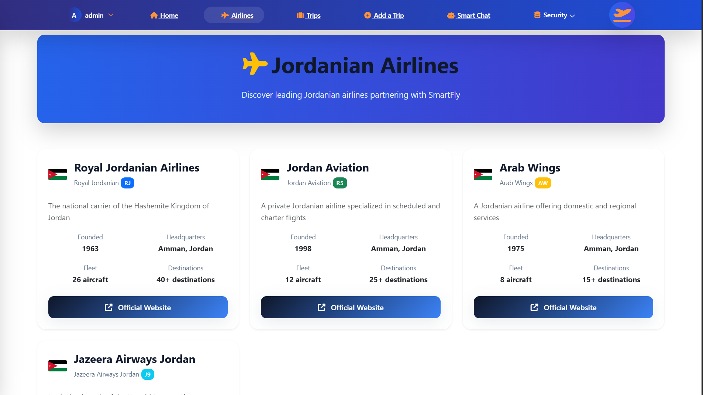
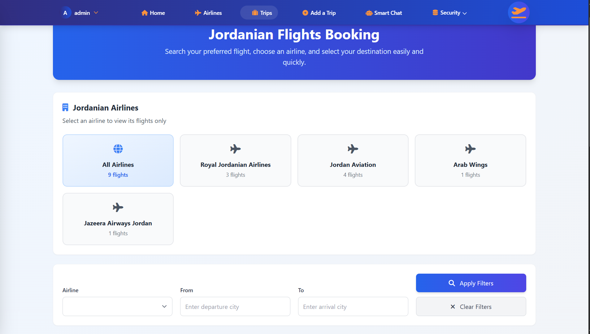

# ✈️ SmartFly
### Intelligent Aviation & Travel Assistant Platform

 

  <b>🚀 Developed during "Build With AI" Hackathon 2025</b>
   
  <i>A unified platform bridging the gap between travelers and Jordanian airlines.</i>

---

## 📖 Overview

**SmartFly** is a comprehensive flight booking and travel assistance platform designed to solve the fragmentation in the Jordanian aviation market. It provides a **unified search engine** for all Jordanian airlines, eliminating the need to compare multiple websites, hidden fees, and confusing pricing structures.

The core innovation is the **SmartFly AI Assistant**, which uses a novel **2-layer Hybrid Architecture** to reduce operational support costs by up to **80%** while providing instant, personalized travel guidance.

---

## 🤖 The Innovation: Hybrid AI Architecture

Unlike standard chatbots, SmartFly implements a cost-efficient dual-layer system:

1.  **Layer 1: Local Knowledge Base ⚡**
    * Handles common FAQs and static data locally.
    * **Result:** Lightning-fast responses & Zero cost per query.
2.  **Layer 2: AI API Fallback (Gemini/ChatGPT) 🧠**
    * Activates only for complex or unexpected user queries.
    * **Result:** High-quality handling of edge cases.

> **Impact:** This architecture is estimated to save ~$37.8K/year for every 500k users compared to direct API calls.

---

## 🚀 Key Features

* **Unified Flight Search:** Aggregates real-time deals from all Jordanian airlines in one dashboard.
* **AI Travel Assistant:** Offers personalized suggestions for baggage, check-in, and meals.
* **Role-Based Access Control (RBAC):** comprehensive admin tools for managing users and permissions.
* **Trip Management:** Seamless reservation management and itinerary planning.
* **Real-time Support:** 24/7 assistance reducing the latency of traditional support channels.

---

## 🛠️ Tech Stack

| Component | Technology | Description |
| :--- | :--- | :--- |
| **Backend** | **PHP Laravel** | Eloquent ORM, Middleware, and API integration. |
| **Frontend** | **Tailwind CSS** | Responsive UI, particle animations, and mobile-friendly menus. |
| **Database** | **MySQL** | Relational database for flight and user data management. |
| **AI Engine** | **Hybrid (Local + API)** | Integration with Large Language Models (LLMs). |
| **Interactivity** | **AJAX / JS** | Seamless asynchronous data loading without page refreshes. |

---

## 📸 Project Gallery

### 🏠 Welcome & Onboarding

  
    
  
    
  

### 🔐 Authentication (Login & Register)

  
    
  

### ✈️ Flights & Airlines Dashboard

  
    
  
    
  

### 📅 Booking Process

  
    
  

### 🤖 Smart AI Assistant

  
    
  

### 🛡️ Admin & Security Controls

  

---

## 👨‍💻 My Contribution

**Abdalrhman Hamed - Full Stack Developer**

* **Designed** a modern, responsive UI using **Tailwind CSS**, featuring advanced interactive elements like particle animations and dynamic dropdowns.
* **Built** a scalable **Laravel** backend structure, utilizing Eloquent ORM for complex database queries and Migrations for schema management.
* **Implemented** secure **Role-Based Access Control (RBAC)** to manage administrative and user privileges effectively.
* **Enhanced** User Experience (UX) by implementing **AJAX** for smooth, non-blocking interactions across the platform.
* **Delivered** clean, modular code under tight hackathon deadlines, focusing on maintainability and scalability.

---

## 🔮 Future Roadmap

* **Regional Expansion:** Covering airlines across the MENA region.
* **Service Integration:** Adding hotels, car rentals, and visa guidance.
* **Data Analytics:** Providing airlines with insights to improve pricing and offers.

---

## 📬 Contact

**Abdalrhman Hamed** - Software Engineer
 

